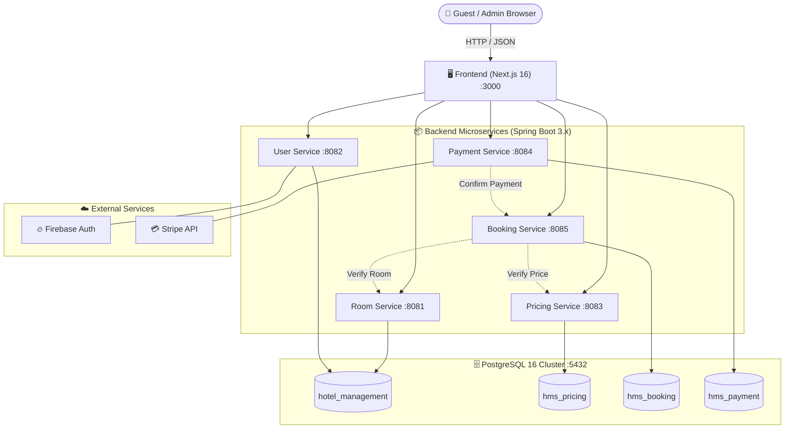

# 🏨 River Nest - Luxury Hotel Management System (HMS)

<div align="center">

[](https://nextjs.org/)
[](https://react.dev/)
[](https://tailwindcss.com/)
[](https://adoptium.net/)
[](https://spring.io/projects/spring-boot)
[](https://www.postgresql.org/)
[](https://www.docker.com/)
[](https://www.selenium.dev/)
[](https://testng.org/)
[](https://stripe.com/)
[](https://firebase.google.com/)
[](https://thilini-piyumika.atlassian.net)

<br/>

**A microservices-based hotel management and reservation platform.**

<br/>

[](https://thilini-piyumika.atlassian.net/wiki/spaces/NIBM2/overview)
[](https://thilini-piyumika.atlassian.net/jira/software/projects/NIBM2/boards)
[](https://github.com/Group-M-HMS/AgileGroupM-Hotel-Management-System)

</div>

---

## 📑 Table of Contents
1. [Project Overview](#-1-project-overview)
2. [Key Features](#-2-key-features)
3. [System Architecture](#-3-system-architecture)
4. [Technology Stack](#-4-technology-stack)
5. [Project Structure](#-5-project-structure)
6. [Main Modules & Components](#-6-main-modules--components)
7. [User Roles](#-7-user-roles)
8. [Database Design](#-8-database-design)
9. [Authentication & Authorization](#-9-authentication--authorization)
10. [API & Backend Services](#-10-api--backend-services)
11. [Installation & Setup](#-11-installation--setup)
12. [Testing Suite](#-12-testing-suite)
13. [Security Considerations](#-13-security-considerations)
14. [Deployment](#-14-deployment)
15. [License](#-15-license)

---

## 🏨 1. Project Overview

**River Nest Hotel Management System (HMS)** is a modular microservices platform designed for seamless hotel reservations and operations. It provides an intuitive guest booking portal paired with robust, isolated backend services to handle room search, dynamic pricing, Stripe payments, and reservation management without concurrency conflicts.

---

## ✨ 2. Key Features

### 🏖️ Guest Booking Portal
- **Room Search & Availability**: Search rooms by dates, guest capacity, and room types with real-time availability checks.
- **Dynamic Pricing**: Automatic multi-night rate calculations with taxes, service charges, and seasonal rates.
- **Stripe Payments**: Secure card checkout using Stripe Elements with automated webhook confirmation.
- **Guest Dashboard & Itineraries**: Firebase-authenticated portal to view booking history, download itineraries, and cancel reservations.

### ⚙️ Backend Architecture
- **5 Microservices**: Specialized Spring Boot services for Rooms, Users, Pricing, Bookings, and Payments.
- **PostgreSQL Isolation**: Dedicated databases per service domain to maintain data boundaries.
- **Double-Booking Protection**: Database-level constraints preventing overlapping date reservations.
- **Secure Inter-Service APIs**: Protected internal communication using shared secrets.

---

## 🏛️ 3. System Architecture

The application is built using a **Microservices Architecture** containerized with Docker Compose:



---

## 💻 4. Technology Stack

| Layer | Primary Technologies | Key Libraries & Tools |
| :--- | :--- | :--- |
| **Frontend** | **Next.js 16** (App Router), **React 19**, **TypeScript 5** | Tailwind CSS v4, Lucide React, FullCalendar |
| **Backend** | **Java 17+**, **Spring Boot 3.x** | Spring Data JPA, Spring Security, Hibernate 6 |
| **Databases** | **PostgreSQL 16** (Alpine) | Multi-database isolation, ACID transactions |
| **Integrations** | **Stripe API** (Java SDK & Elements), **Firebase Auth** | Webhook signature verification, JWT auth |
| **Testing & QA** | **Selenium WebDriver 4.24**, **TestNG 7.10** | Apache Maven 3.9, automated screenshot capture |
| **DevOps & Tools** | **Docker & Docker Compose**, **GitHub Actions** | Multi-stage container builds, CI/CD pipeline |

---

## 📁 5. Project Structure

```text
hotel-management-system/
├── .env.example                     # Environment variables template
├── docker-compose.yml               # Multi-container orchestration definition
├── LICENSE                          # MIT License
├── README.md                        # Master repository documentation
│
├── backend/                         # Java Spring Boot Microservices
│   ├── booking-service/             # Port 8085: Reservations, cancel & check-in/out
│   │   ├── pom.xml                  # Maven build configuration
│   │   ├── Dockerfile               # Container build file
│   │   └── src/main/java/com/hms/booking_service/
│   │       ├── controller/          # BookingController & BookingInternalController
│   │       ├── service/             # Booking business logic
│   │       ├── entity/              # Booking JPA entities & BookingStatus enum
│   │       └── repository/          # PostgreSQL Data JPA repositories
│   │
│   ├── payment-service/             # Port 8084: Stripe sessions, webhooks & receipts
│   ├── pricing-service/             # Port 8083: Rate calculation & seasonal pricing
│   ├── room-service/                # Port 8081: Room inventory, amenities & filters
│   └── user-service/                # Port 8082: Firebase Auth & guest profiles
│
├── frontend/                        # Next.js 16 Web Application
│   ├── package.json                 # Node dependencies & scripts
│   ├── next.config.ts               # Next.js configuration
│   ├── Dockerfile                   # Multi-stage production container build
│   └── app/                         # App Router Pages & Components
│       ├── page.tsx                 # Landing / Home Page
│       ├── room/                    # Room details & discovery views
│       ├── search-results/          # Room search results & filter engine
│       ├── checkout/                # Stripe Elements checkout flow
│       ├── dashboard/               # Customer reservation itinerary dashboard
│       ├── manage-booking/          # Booking cancellation & self-service
│       ├── login/ & signup/         # Firebase authentication forms
│       └── admin/                   # Administrative operations view
│
├── deploy/                          # Deployment & initialization assets
│   └── postgres-init/
│       └── init-databases.sh        # SQL script creating the 4 isolated databases
│
└── testing/                         # Selenium + TestNG E2E Automation Framework
    ├── pom.xml                      # Maven testing dependencies
    ├── testng.xml                   # Test suite configuration (33 test classes)
    ├── seed.py                      # Python database seeding script
    └── src/test/java/com/nibm2/     # Automated E2E test suites
```

---

## 🧩 6. Main Modules & Components

| Module / Service | Domain Responsibilities | Key Entities & Models | Primary API Handlers |
| :--- | :--- | :--- | :--- |
| **`room-service`** | Room catalog, date availability search, amenity tags & image gallery | `Room`, `RoomAmenity`, `RoomImage`, `Booking` | `RoomController`<br>`RoomDetailController` |
| **`user-service`** | Firebase JWT verification, customer profiles & booking history | `User` | `AuthController`<br>`UserController`<br>`BookingHistoryController` |
| **`pricing-service`** | Dynamic pricing engine, seasonal rates, taxes & stay duration math | *(Stateless Engine)* | `PricingController` |
| **`booking-service`** | Reservation lifecycle, 1-click check-in/out, cancellation & audit | `Booking`, `BookingStatus` | `BookingController`<br>`BookingInternalController` |
| **`payment-service`** | Stripe Checkout session creation & webhook event processing | `Payment` | `PaymentController`<br>`StripeWebhookController` |

---

## 👥 7. User Roles

| Role | Access Level | Capabilities |
| :--- | :--- | :--- |
| **Anonymous Guest** | Public Portal | Browse rooms, apply date/guest filters, view amenities, pricing, and resort details. |
| **Authenticated Customer** | Customer Dashboard | Create reservations, pay via Stripe, view booking history, download itineraries, cancel bookings. |
| **Administrator / Front Desk** | Admin Operations | Access operational metrics, manage room statuses, and view master reservation records. |

---

## 🗄️ 8. Database Design

The PostgreSQL instance is provisioned with 4 dedicated databases for microservice domain boundary isolation:

```sql
-- deploy/postgres-init/init-databases.sh
CREATE DATABASE hotel_management;  -- room-service & user-service
CREATE DATABASE hms_pricing;       -- pricing-service
CREATE DATABASE hms_booking;       -- booking-service
CREATE DATABASE hms_payment;       -- payment-service
```

### Core Entities & Relationships

```
┌───────────────────────────┐         ┌───────────────────────────┐
│           users           │         │           rooms           │
├───────────────────────────┤         ├───────────────────────────┤
│ id (PK, UUID)             │         │ id (PK, BIGINT)           │
│ email (VARCHAR, UNIQUE)   │         │ room_number (VARCHAR)     │
│ full_name (VARCHAR)       │         │ room_type (VARCHAR)       │
│ phone_number (VARCHAR)    │         │ base_price (NUMERIC)      │
│ created_at (TIMESTAMP)    │         │ max_capacity (INT)        │
└─────────────┬─────────────┘         └─────────────┬─────────────┘
              │ 1                                   │ 1
              │                                     │
              │ N                                   │ N
              ▼                                     ▼
┌─────────────────────────────────────────────────────────────────┐
│                            bookings                             │
├─────────────────────────────────────────────────────────────────┤
│ id (PK, BIGINT)                                                 │
│ customer_id (VARCHAR, Indexed)                                  │
│ room_id (BIGINT, FK -> rooms.id)                                │
│ check_in_date (DATE)                                            │
│ check_out_date (DATE)                                           │
│ total_amount (NUMERIC)                                          │
│ booking_status (VARCHAR: PENDING, CONFIRMED, CANCELLED)         │
│ created_at (TIMESTAMP)                                          │
└─────────────────────────────────────────────────────────────────┘
```

---

## 🔐 9. Authentication & Authorization

- **Client Authentication**: Handled via **Firebase Authentication** on the Next.js frontend (Email/Password & OAuth).
- **Session Header Propagation**: Upon login, the frontend passes the authenticated user's Firebase UID via the `X-User-Id` request header to backend services.
- **Controller Route Guards**: Protected Spring Boot endpoints validate the `X-User-Id` header and reject unauthenticated requests:
  ```java
  private void requireAuthenticated(String customerId) {
      if (customerId == null || customerId.isBlank()) {
          throw new UnauthorizedException("Authentication required");
      }
  }
  ```
- **Service-to-Service Security**: Internal endpoints (e.g. payment confirmations) require an `X-Internal-Secret` header matching the shared `INTERNAL_SERVICE_SECRET`.

---

## 🌐 10. API & Backend Services

### Booking Service (`:8085`)
| Method | Endpoint | Access | Description |
| :---: | :--- | :---: | :--- |
| `POST` | `/api/v1/bookings` | Authenticated | Create a new room booking |
| `GET` | `/api/v1/bookings/my` | Authenticated | List all bookings for the logged-in user |
| `GET` | `/api/v1/bookings/my/{bookingId}` | Authenticated | Retrieve booking details by ID |
| `POST` | `/api/v1/bookings/{bookingId}/cancel` | Authenticated | Cancel an existing reservation |
| `POST` | `/api/v1/internal/bookings/{id}/confirm-paid` | Internal | Confirm booking payment via internal secret |

### Room Service (`:8081`)
| Method | Endpoint | Access | Description |
| :---: | :--- | :---: | :--- |
| `GET` | `/api/v1/rooms` | Public | Search available rooms with date & guest filters |
| `GET` | `/api/v1/rooms/{id}` | Public | Retrieve room details, amenities, and image gallery |

### User Service (`:8082`)
| Method | Endpoint | Access | Description |
| :---: | :--- | :---: | :--- |
| `POST` | `/api/v1/users/register` | Public | Register user profile linked to Firebase UID |
| `GET` | `/api/v1/users/profile` | Authenticated | Retrieve authenticated user profile |

---

## ⚙️ 11. Installation & Setup

### Prerequisites
- **Docker & Docker Compose** (v24.0+)
- **Node.js** (v18+) & **npm** (for local frontend development)
- **Java JDK 17+** & **Apache Maven 3.9+** (for local backend development)
- **Google Chrome** (for Selenium E2E test execution)

---

### Step 1: Clone the Repository
```bash
git clone https://github.com/Group-M-HMS/AgileGroupM-Hotel-Management-System.git
cd AgileGroupM-Hotel-Management-System
```

### Step 2: Configure Environment Variables
Create your local `.env` file from the provided `.env.example`:
```bash
cp .env.example .env
```

Edit `.env` and set your preferred credentials:
```env
DB_USERNAME=postgres
DB_PASSWORD=your_secure_password
IMAGE_PREFIX=ghcr.io/group-m-hms
IMAGE_TAG=latest
CORS_ALLOWED_ORIGIN=http://localhost:3000
STRIPE_SECRET_KEY=sk_test_your_stripe_test_key
INTERNAL_SERVICE_SECRET=your_shared_internal_secret
```

### Step 3: Run the Stack with Docker Compose
Start the PostgreSQL multi-database container, all 5 Spring Boot backend services, and the Next.js frontend with a single command:
```bash
docker compose up --build -d
```

### Step 4: Verify Running Services
```bash
docker compose ps
```

### Step 5: Access the Application
- 🌐 **Frontend Application**: [http://localhost:3000](http://localhost:3000)
- 🏨 **Room Service**: [http://localhost:8081/api/v1/rooms](http://localhost:8081/api/v1/rooms)
- 📅 **Booking Service**: [http://localhost:8085/api/v1/bookings](http://localhost:8085/api/v1/bookings)
- 🗄️ **PostgreSQL Database**: `localhost:5432`

---

## 🧪 12. Testing Suite

The repository includes a dedicated automated testing suite in `testing/` built with **Java 17**, **Selenium WebDriver 4.24.0**, and **TestNG 7.10.2**.

```
========================================================================================================
AUTOMATED TESTING SUMMARY (33 Test Suites across 5 Feature Domains)
========================================================================================================
1. Authentication & Security   : LoginTest, RegisterTest, LoginSecurityTest, LogoutTest, ProfileTest
2. Dashboard & Bookings        : MyBookingsNavTest, DashboardUpcomingBookingsTest, DashboardPastBookingsTest
3. Itinerary & Cancellation    : DashboardItineraryPrintTest, DashboardCancellationEligibilityTest
4. Stripe Elements & Payment   : StripePaymentElementsSecurityTest, CheckoutPricingValidationTest
5. Responsive Viewport Tests   : MobileCheckoutFormTest, ResponsiveDashboardNavigationTest
========================================================================================================
```

### Running Automated E2E Tests

1. Ensure the application is running at `http://localhost:3000`.
2. Seed test data (optional helper):
   ```bash
   python testing/seed.py
   ```
3. Execute the full TestNG test suite:
   ```bash
   cd testing
   mvn clean test
   ```
4. Test execution reports and timestamped screenshot evidence are generated in `testing/test-output/`.

---

## 🛡️ 13. Security Considerations

- **PCI Compliance**: Credit card information is handled directly through Stripe Elements; sensitive card details never touch application servers.
- **Service Isolation**: Internal endpoints (e.g. payment confirmations) cannot be triggered from public clients without the shared `INTERNAL_SERVICE_SECRET`.
- **CORS Protection**: Spring Boot services enforce strict origin checks matching `CORS_ALLOWED_ORIGIN`.
- **Credential Hygiene**: Secrets, Firebase private service account keys, and Stripe keys are excluded from git via `.gitignore`.

---

## 🚢 14. Deployment

The system is configured for containerized deployment:
- **Docker Compose**: Pre-configured multi-container stack (`docker-compose.yml`) for VM or container host deployment.
- **Database Initialization**: Automated multi-database provisioning on container boot via `deploy/postgres-init/init-databases.sh`.
- **Production Container Builds**: Dockerfiles provided for each microservice under `backend/*/Dockerfile` and `frontend/Dockerfile`.

---

## 📄 15. License

This project is licensed under the **MIT License** - see the [LICENSE](LICENSE) file for details.

<div align="center">
  <sub>River Nest Hotel Management System • Group M • BSc (Hons) Computing & AI • 2026</sub>
</div>
